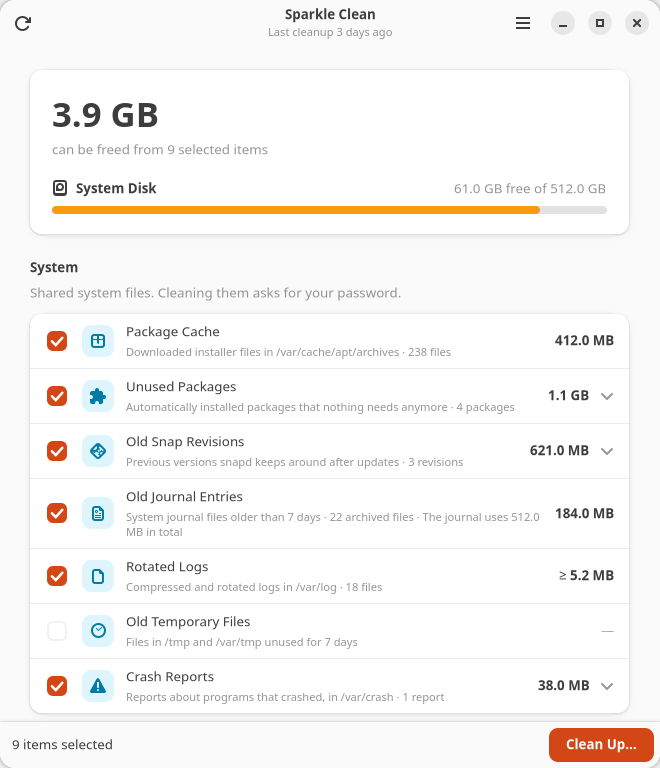
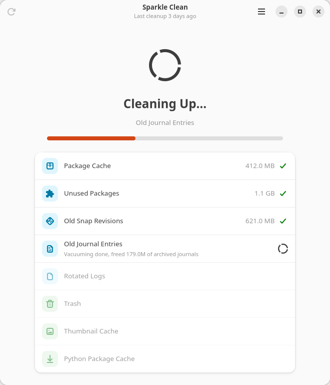
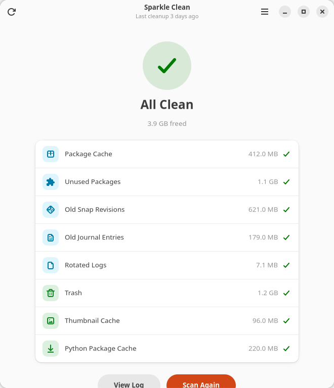
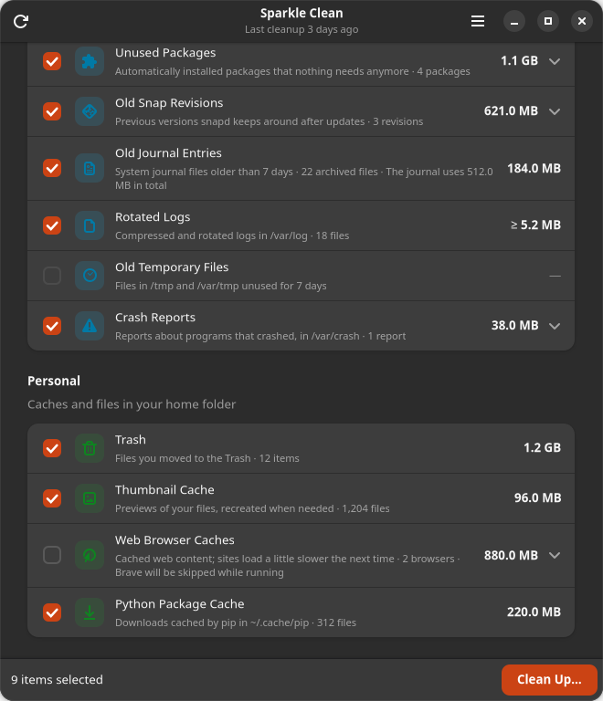

# Sparkle Clean

[](https://github.com/wakedog/sparkle-clean/actions/workflows/ci.yml)
[](LICENSE)

Free up disk space on Ubuntu, safely.

Sparkle Clean finds files that are safe to delete (package caches, unused
packages, old journal entries, rotated logs, stale temporary files, old snap
revisions, crash reports, thumbnails, the Trash and developer or browser
caches), shows how much space each takes, and cleans only what you pick. It
is a GNOME desktop app with a matching command-line interface, rebuilt from
the `sparkle-clean.sh` script.



## Install

Download the `.deb` from the
[latest release](https://github.com/wakedog/sparkle-clean/releases/latest) and
install it with `sudo apt install ./sparkle-clean_*_all.deb`, or build it
from source:

```bash
sudo apt install git make
git clone https://github.com/wakedog/sparkle-clean.git
cd sparkle-clean
make deb
sudo apt install ./dist/sparkle-clean_1.0.0_all.deb
```

Then open **Sparkle Clean** from the app grid, or run `sparkle-clean`.
Remove it again with `sudo apt remove sparkle-clean`.

It needs Ubuntu 24.04 or newer (GTK 4 and libadwaita 1.5+), and is developed
on Ubuntu 26.04. Everything it depends on ships with a standard Ubuntu desktop.

## Using the app

The app scans as soon as it opens. Nothing is changed by scanning.

- Tick the categories you want to clean. Your choices are remembered.
- Expand a row to see exactly which packages, snap revisions, crash reports or
  browsers are involved.
- **Clean Up** asks for confirmation, then for your password once if any
  system items are selected.
- Every cleanup is logged. **Cleanup History** in the main menu shows past runs
  and the space they freed; **View Log** shows every file that was removed.
- **Preferences** sets how many days of temporary files, journal history and
  rotated logs to keep.

| Cleaning | Finished |
| --- | --- |
|  |  |

It follows the system's light or dark style:



## Command line

```bash
sparkle-clean scan                                  # what can be cleaned; changes nothing
sparkle-clean clean                                 # scan, confirm by typing "yes", clean
sparkle-clean clean --dry-run --include browsers    # preview, including browser caches
sparkle-clean clean --only apt_cache,orphans --yes  # unattended, just these categories
sparkle-clean scan --json | jq .selected_size       # bytes reclaimable, for monitoring
sparkle-clean categories                            # ids and what is selected
sparkle-clean history                               # past cleanups
```

The command line uses the same selection and limits as the app. Exit status is
0 on success, 1 if some category could not be cleaned, and 2 for bad arguments.
See `man sparkle-clean` for everything else.

## What it cleans

| Category | id | How | Default |
| --- | --- | --- | --- |
| Package cache | `apt_cache` | `apt-get clean` | on |
| Unused packages | `orphans` | `apt-get autoremove --purge` | on |
| Old snap revisions | `snaps` | `snap remove --revision` for disabled revisions | on |
| Old journal entries | `journal` | `journalctl --vacuum-time` (7 days kept) | on |
| Rotated logs | `old_logs` | `/var/log/**/*.gz`, `*.[0-9]`, `*.old` | on |
| Old temporary files | `tmp` | files in `/tmp` and `/var/tmp` unused for 7 days | on |
| Crash reports | `crash` | `/var/crash/*.crash` and upload markers | on |
| Unused Flatpak runtimes | `flatpak` | `flatpak uninstall --unused` | on |
| Trash | `trash` | your Trash | on |
| Thumbnail cache | `thumbnails` | `~/.cache/thumbnails` | on |
| Web browser caches | `browsers` | Firefox, Chrome, Chromium, Brave, Edge, Vivaldi, Opera | off |
| Python package cache | `pip` | `~/.cache/pip` | on |
| npm cache | `npm` | `~/.npm/_cacache` | on |

Categories that don't apply (no snapd, no Flatpak, no npm) are hidden.

## Safety

- **Nothing is deleted without confirmation.** The command line still requires
  typing `yes` unless you pass `--yes`.
- **Root access is narrow.** System items are cleaned by a separate helper,
  `/usr/libexec/sparkle-clean/sparkle-clean-helper`, started through `pkexec`
  and authorized by a polkit policy. It accepts only fixed task names and
  range-checked numbers, never paths or commands, and runs `apt-get`,
  `journalctl` and `snap` with fixed arguments.
- **Deletion can't be redirected.** Files are removed relative to open
  directory handles, symbolic links are never followed, and other filesystems
  are never entered.
- **Files in use are kept.** Temporary files that any process has open, X11
  lock files, and the private folders of systemd services and snaps are always
  kept. A file only counts as unused when its access, modification and change
  times are all older than the limit.
- **Running browsers are skipped**, and browser caches are off by default.
- **Everything is recorded** in `~/.local/state/sparkle-clean/logs/`, including
  each file the helper removed.

## Changes from `sparkle-clean.sh`

- Unused packages now show their real size. The script always showed 0 because
  `apt-get -s` never prints how much space would be freed.
- The journal estimate is exact (archived files older than the limit) rather
  than a guess of 60%.
- Temporary file cleanup no longer removes files that are open, X11 lock files,
  or recently modified files that were not recently read.
- Added crash reports, browser caches, adjustable limits, history and logs.

## Development

See **[docs/DEVELOPMENT.md](docs/DEVELOPMENT.md)** for setting up a
development machine, how the code fits together, adding a cleanup category and
releasing a new version, and [CONTRIBUTING.md](CONTRIBUTING.md) for the ground
rules. The short version:

```bash
make run                  # run the app from this folder
make test                 # unit tests
make check                # tests plus desktop, AppStream and polkit validation
make deb                  # build dist/sparkle-clean_<version>_all.deb
tools/screenshots.py      # re-render data/screenshots on a hidden display
```

Running from the source tree works without installing. Polkit then shows its
generic "run a program as administrator" prompt, because the policy only
applies to the installed helper.

```text
sparkle_clean/
  categories.py   what can be cleaned, and how each category is measured
  helper.py       privileged helper (standard library only, runs as root)
  engine.py       scan and clean orchestration, logs, history
  cli.py          command-line interface
  gui/            GTK 4 / libadwaita app
data/             icons, .desktop file, AppStream metadata, polkit policy, man page
packaging/        .deb build script
tests/            unit tests
tools/            screenshot renderer
docs/             developer guide
.github/          CI and release workflows
```

## License

MIT. See [LICENSE](LICENSE).
